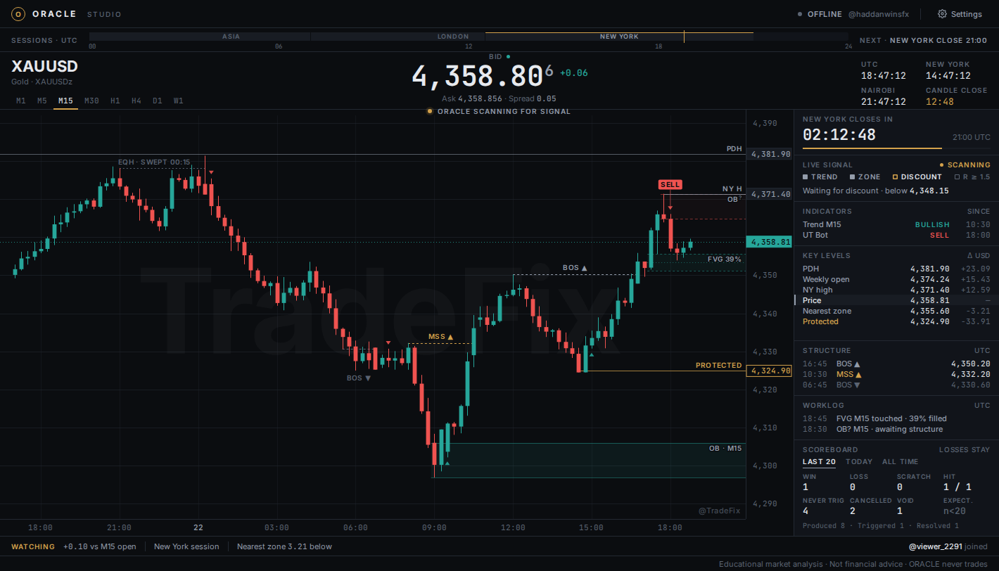
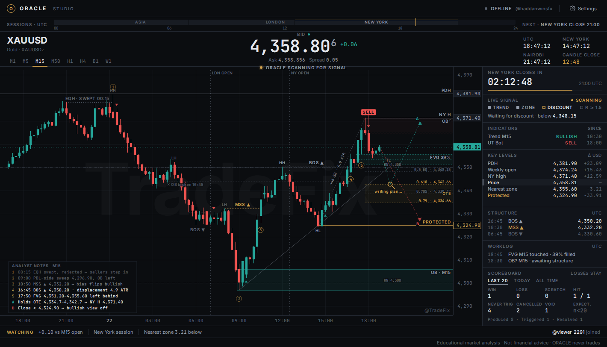

# TradeFix Studio

[Download the Windows installer](https://github.com/Roy-Mutwiri/TradingViewVision/releases/latest/download/TradeFix-Studio-Setup.exe)





The installer includes the desktop app and bundled source resources. On first launch, TradeFix Studio uses the bundled engine and the bundled Python 3.12 runtime to prepare its private requirements environment.

Read-only educational terminal for Trade Fix. Phase 0 contracts are approved with
binding Phase 1 revisions. Phase 1 foundations are implemented; the real broker
replay gate has not passed. Later-phase modules remain typed stubs.

## Setup

Python 3.12+, Node 22+. Run from the repository root (PowerShell):

```powershell
python3.12 -m venv .venv312
.\.venv312\Scripts\python.exe -m pip install -e './engine[dev]'
npm.cmd --prefix app ci
.\.venv312\Scripts\python.exe -m oracle.cli check-config
.\.venv312\Scripts\python.exe -m oracle.cli dashboard
```

Dashboard: http://127.0.0.1:8765. On Linux/macOS use `.venv312/bin/python`
and `npm`. Runtime paths are relative to the working directory. No credentials
belong in the repository.

```powershell
Push-Location engine
..\.venv312\Scripts\python.exe -m pytest
..\.venv312\Scripts\ruff.exe check oracle tests
..\.venv312\Scripts\mypy.exe --strict oracle
Pop-Location
npm.cmd --prefix app run protocol:generate
npm.cmd --prefix app run build
```

Pydantic emits JSON Schema directly. json-schema-to-typescript generates
`app/src/net/protocol.ts`; build checks both files for drift. An additional
Python-model generator would duplicate canonical definitions and is not used.
Set ORACLE_PYTHON to override the codegen interpreter.

## Binding Phase 1 configuration

The canonical broker is `exness`, with symbols `XAUUSD`, `XAUUSDm`, and
`XAUUSDc`. Startup asserts measured offsets are in `{0, 3600}`; zero still uses
the clock layer. The actual MT5 server group is bound to the history store on
first connection; subsequent server changes require a separate store. Optionally
pin `data.canonical_server` as well.

MT5 integers are treated as broker wall-clock epochs per the binding adjudication.
The authoritative raw table is keyed by broker, timeframe, and `t_broker_ms`.
UTC projections retain both timestamps and `clock_version` in storage. Raw
provenance types live in `data/`; wire models expose only UTC `t_open_ms`.

`BrokerClock` is frozen and versioned, with ordered, gapless offset spans covering
all time. A live measurement bootstraps total coverage; earlier bars are labelled
ASSUMED and are served immediately. Legacy transition files migrate on load.
Observed long closures delimit
trading weeks; each week is independently aligned against 500 vendor UTC M1 bars,
and offset changes become effective at the first observed reopened bar. No EU
or US DST calendar is assigned to the broker. A changed clock reconstructs UTC
projections from untouched raw epochs in a transaction. A failed reconstruction
keeps the previous projection and the raw archive. Legacy MT5 rows without raw
epochs must be reacquired. Readers reject projections from a stale clock version.

Startup checks OHLC correlation across -5h through +4h in 15-minute steps. Every
candidate uses the same 500 bars and needs complete reference coverage. Correlation
must be at least 0.95, and price-change correlation must independently identify
the same distinct peak. The live sample is taken far enough in the past to avoid
requiring future vendor prices for negative offset candidates. Insufficient data,
an ambiguous peak, or disagreement with measurement fails the configured proof.
An unset vendor key produces an unproven warning and blocks no history. Clock
offsets and versions are logged at INFO on startup/change. Background refinement
waits for 30 days of M1; it reconstructs stored UTC times, emits ClockRefined,
and sends a fresh chart snapshot. Provisional golden headers carry ASSUMED
confidence and fail with "clock refined, regenerate" after a version change.

Lifecycle IDs use BLAKE2b with an 8-byte digest over immutable identity fields,
including true UTC timestamps. Render hashes include mutable content. Clock
corrections change affected bar identities; golden headers invalidate the entire
set explicitly with `clock changed, regenerate`. State hashes carry no clock
provenance. The calendar derives from normalized UTC bars and carries broker/clock
provenance in its data-layer artifact; stale calendar artifacts cannot pass proof.

Analytical PDH/PDL/PWH/PWL and daily open are aggregated from M1 using
`17:00 America/New_York`; midnight open uses `00:00 America/New_York`.
`zoneinfo` resolves each boundary separately, including 23/25-hour days and US/EU
DST divergence. D1/W1 input is rejected for these levels; broker HTF candles are
reserved for structure, and their different boundaries are logged by design.

The previous README proposals for content IDs that changed during lifecycle
transitions, SHA-256, an operator-selected price unit, operator-supplied gap
intervals, and an unresolved timestamp basis are superseded by the rulings.

The configured M1 depth is 90 days, while calendar derivation needs 180 days.
Calendar acquisition must request the larger window independently.

## Real clock verification and Phase 1 proof

Install the MT5 extra and configure `TWELVE_DATA_API_KEY` locally. Do not put keys
in YAML or source control. Open the read-only local Exness MT5 terminal:

```powershell
.\.venv312\Scripts\python.exe -m pip install -e './engine[dev,mt5]'
.\.venv312\Scripts\python.exe -m oracle.cli clock-derive --start-ms <UTC-ms> --end-ms <UTC-ms>
.\.venv312\Scripts\python.exe -m oracle.cli clock-proof --year 2025
```

Acquisition must cover all stored M1 history through the present. Derivation
validates each observed trading week against vendor UTC data before replacing the
clock. The seasonal proof reads 500 actual MT5 bars in both January and July and
asserts the correlation argmax equals the derived clock. It writes
`runtime/clock-proof.json`; no artifact is written if either window fails. The
same real tests run in `engine/tests/integration/test_real_clock.py` when the
vendor key and MT5 integration are available. `ORACLE_CLOCK_PROOF_YEAR` selects
another year. Missing prerequisites produce explicit skips, never fixture passes.

`oracle replay-proof --input broker-bars.json --calendar calendar.json
--start-ms <UTC-ms> --end-ms <UTC-ms>` validates at least 30 days of complete,
pure-MT5 M5 history, fails on unexplained gaps, and prints per-timeframe counts.
Input carries `canonical_broker`, `clock_version`, and `bars`.
`data.golden_source.write_golden` accepts provenance records and the current clock;
`replay.golden.read_golden` receives only the broker/version header and UTC bars;
raw provenance and clock conversion remain in the data layer.
Generate calendar JSON with `derive_calendar(normalized_bars, clock)` after UTC
reconstruction. Replay proof also requires current January/July correlation
proofs and a calendar with matching broker/clock provenance.

Synthetic fixtures validate implementation only. The real January/July checks
and broker replay gate have not passed in this workspace. Remaining Phase 1
integration work includes live minute verification scheduling, weekly calendar
refresh scheduling, assertion table comparison, calendar-driven Director
behavior, and full configured history acquisition.

## Phase 3a desktop login gate

Launch the Windows desktop from this workspace:

```powershell
.\.venv312\Scripts\python.exe -m pip install -e './engine[dev,mt5]'
npm --prefix app ci
npm --prefix app run desktop
```

Only the login window opens initially. Investor access is the default. The
authenticated preflight checks account mode, symbol economics, clock, history
depth, and spread before the engine permits Studio entry. Missing vendor
credentials produce an amber unproven clock warning and permit entry; they do
not satisfy the separate Phase 1 January/July clock proof.

Saved profile metadata resides in Electron's user-data directory; passwords
reside only in Windows Credential Manager under `oracle-studio`. The private
login IPC and Python stdin protocol are separate from broadcast contracts.
Studio receives only account-mode, clock-proof, and connection flags, with a
persistent DEMO/REAL badge. Account switching restarts the worker, and history
and clock artifacts are isolated by broker, server, and login. No order-placement
adapter is exposed. Optional idle locking is configured with
`security.idle_lock_min`; it is off by default.

Server seeds are editable in `config/brokers/exness.yaml`; terminal discovery and
free text remain available. Signup and download links open the external browser.
Set `broker.signup_url` to the partner URL when available.

Validation commands:

```powershell
.\.venv312\Scripts\python.exe -m pytest engine/tests -q
npm --prefix app run test:visual
npm --prefix app run test:desktop
```

The desktop smoke test exercises real Electron, its sandboxed preload, and the
Python worker without submitting broker credentials. Live MT5 tests are marked
`windows_live` and explicitly skip missing prerequisites. To run the login proof
after remembering the investor profile locally, set `ORACLE_RUN_WINDOWS_LIVE=1`
and run `engine/tests/integration/test_live_login.py`.

The live Phase 3a proof for `81740106` on `ExnessKE-MT5Trial10` remains pending:
the investor password is not present in the local keychain. Enter it in the
desktop login screen, not in source files or chat. This phase lands in an empty
Studio. Phase 3b adds the chart described below.

## Phase 3b chart and proof status

The authenticated Studio now uses a [Lightweight Charts v5](https://tradingview.github.io/lightweight-charts/docs/5.0) adapter for broker
XAUUSD candles, M1–W1 switching, UTC countdowns, quality chips, and observed
session-closure shading. Milliseconds convert to chart seconds only inside the
adapter. `chart.visible_bars`, `chart.lookback`, and `chart.update_hz` configure
the snapshot depth and throttling (defaults 1500, 500, and 10).

Press backtick to open operator diagnostics: raw/UTC timestamps, clock version,
OHLC, tick volume, spread, tick age, and a bounded broker-correction log. Debug
provenance uses its own IPC contract and never positions candles. The chart
transport excludes account metadata and money. The symbol header exposes the
resolved spelling for diagnosis; the canonical series remains `XAUUSD`.
Continuous `247` gold variants are denied before terminal selection.

Calendar acquisition requests 180 days of M1 independently of chart timeframe.
While derivation is pending, normal weekly/daily closures use an explicitly
assumed template and report CALENDAR_PENDING. In-session holes remain GAPPED
and list their UTC ranges in operator diagnostics. Measured recurring closures forecast the next week; fixed
holiday dates do not invent closures. Calendar artifacts remain isolated with
the account's clock/store and are diff-logged. Minute reconciliation trusts
broker rates, publishes corrections, and refetches the affected broker HTF
candle. Broker D1/W1 boundaries are preserved for chart parity.

```powershell
npm --prefix app run test:chart
npm --prefix app run test:visual
npm --prefix app run test:desktop
```

`engine/tests/integration/test_real_chart_parity.py` is a `windows_live` parity test:
50 closed OHLC candles and M1 → H1 → M5 counts against actual terminal rates.
It requires `ORACLE_RUN_WINDOWS_LIVE=1` and the investor keychain profile.
Historical confidence is metadata and never blocks charting. Synthetic visual/performance
fixtures are expressly not substitutes for live proof. Browser performance
metrics are written to `app/test-results/synthetic-chart-performance.json`.

The real Electron bootstrap was verified with the saved master profile on
`81740106` / `ExnessKE-MT5Trial10`: 2,000 M5 bars on `XAUUSDz`, historical
confidence ASSUMED, offset zero, clock v1, DEMO, clock unproven, an advancing
countdown, and no renderer exceptions. Evidence is in
`artifacts/phase3b/live-bootstrap.json` and `live-bootstrap.png`. Reproduce with
`ORACLE_RUN_WINDOWS_LIVE=1` and `node scripts/live-bootstrap.mjs` from the app
directory. No password enters Node;
the worker retrieves the existing OS-keychain profile.

History warm-up makes bounded descending `copy_rates_from` requests in preflight
and reports actual per-timeframe bar counts. Set Max bars in chart to Unlimited
and scroll back in MT5 to continue its lazy download. Calendar acquisition runs
in bounded background chunks after snapshot delivery. Too little M1 history is
pending work. Typed IPC errors retain code, message, safe numeric detail, and
recoverability; Studio renders the cause and displays detail in its debug drawer.
Zero candles report NO_DATA. A source test forbids generic boundary failure text.

**The full Phase 3b proof remains open:** the 60-second side-by-side recording,
weekend parity, 30-minute live soak, and live renderer CPU proof are not complete.

Phase 3c routes all MT5 SDK access through `data/mt5_gateway.py`: one dedicated
thread, tick/foreground/bulk priorities, bulk capped at 1,000 bars (5,000 absolute
maximum) and an adaptive reduction if a call exceeds 200ms. Foreground switches
pause bulk. Queue depths, wait/call times and recent tick latency appear in
telemetry and operator diagnostics; excessive latency degrades data quality.
The 50ms quote poll feeds a separate throttled IPC stream, so header bid/ask,
spread and tick age continue during chart/store/indicator work. Candle math
still comes from ticks, reconciled with broker rates once a second.

Backfill owns a separate DuckDB connection and persists its earliest broker
epoch per symbol/timeframe. Restarts resume that cursor. Writes use small,
serialized transactions; calendar scans run off the command path. DuckDB's
pandas adapter is preloaded before threads start: with it absent, the local
driver repeatedly attempted optional imports for bulk parameters, producing
seconds of avoidable latency. Warm switches read DuckDB and cache decoded frozen
bars; only missing older data is requested at foreground priority. Fully covered
M1 buckets supply higher timeframes; native broker candles take precedence.

UT Bot is a pure engine indicator in `oracle/indicators/ut_bot.py`. Wilder ATR,
HA close, trailing stops, closed-bar flips and colouring are deterministic.
Defaults and per-timeframe overrides live under `indicators.ut_bot`; M1 defaults
off and H1 defaults to key 2. Labels use DrawObject, with a separate oldest-first
budget, localized Buy/Sell text and hollow 45%-opacity `?` previews. The first
30 bars at default settings emit no signals. Stop-line and candle-colour toggles
live in the operator drawer; provisional conversion/removal counts and warm-up
are shown there. UT Bot remains an **indicator**, outside SMC confluence.
The 2,000-M15-bar frozen test file is explicitly a synthetic maths fixture, not
a broker-history regression baseline. Same-feed OANDA parity is not claimed:
it needs the exact OANDA bars/warm-up prefix and TradingView reference labels.
`oracle.indicators.parity.verify_oanda_labels` compares those inputs when available.
The external integration test skips unless `ORACLE_OANDA_PARITY_INPUT` points to
JSON containing `feed: OANDA:XAUUSD`, vendor-origin `bars`, and `reference`
(`feed`, `key`, `atr_period`, `heikin_ashi`, closed-bar `buy`/`sell` UTC-ms lists).
Labels before the supplied prefix's warm-up ends are excluded from the comparison.

Observed non-recurring early closes can be shorter than four hours. They are
recognized only when longer than a measured regular maintenance closure and
ending within one minute of its recurring weekly reopen phase. Arbitrary
in-session holes remain unexplained. This covers the actual September 7
18:30–22:00 UTC closure without hardcoding a holiday date or using a vendor
calendar as the authoritative source.

Run the real local probe with `ORACLE_RUN_WINDOWS_LIVE=1` and
`node scripts/live-phase3c.mjs` from `app/`. Evidence is written to
`artifacts/phase3c/live-latency.json` and `live-latency.png`. It uses the saved
master DEMO profile and retains its warning banner. Quote delivery is measured
from first local gateway receipt; broker event age is recorded separately rather
than attributed to ORACLE. Cold/missing-history switches are distinguished from
warm snapshots of 2,000 candles.

The September 17 local probe delivered quotes within 97ms of gateway receipt
while downloading over 90,000 M1 bars. Its warmed 2,000-bar M5/M15 IPC switches
took 69–95ms; a cold, partial H1 request took 184ms and a repeated partial H1
request took 62ms. No engine or renderer faults occurred. The observed early
close was explained by the derived calendar, leaving CALENDAR_PENDING with no
missing ranges. This short probe does not establish a long-session performance
guarantee or the still-pending same-feed OANDA comparison.

Phase 4 adds the broadcast/operator split and the audience retention layer.
See [Phase 4 operation and evidence](docs/phase4.md) for controls, local comment
ingestion, capture provenance, and retention reports. Window dimensions, aspect
ratio and display scaling are unchanged.
